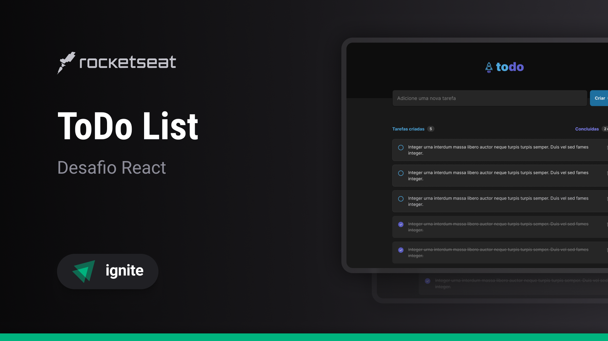

# ToDo List - [VER DEPLOY](https://todo-list-delta-teal.vercel.app)

Projeto de Todo List, onde temos as funções relacionadas ao controle de tarefas concluídas



## Tecnologias

<div align="start">
  
  
  
</div>

## Manual de uso

### Inicialiando o site - [http://localhost:5173/](http://localhost:5173/)

```sh
npm install
```

```sh
npm run dev
```
