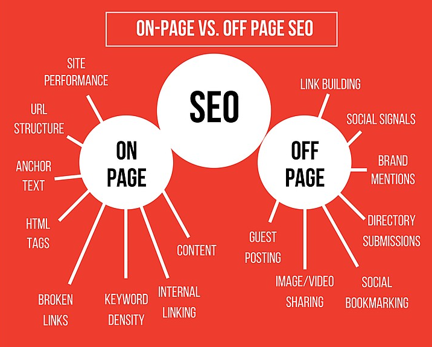
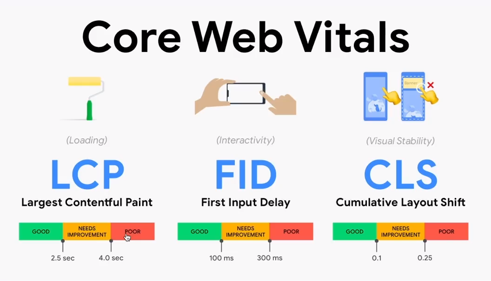

# SEO - Search Engine Optimization
- Otimização para Motores de Busca
- Páginas HTML aparecendo nas pesquisas
- Melhora o tráfego no seu site, aumentando a visibilidade de marca e consequentemente as vendas

## Fatores fundamentais da otimização

### On-page
  - Técnico - Desenvolvedor
  - Conteúdo - Copywriter/Redator
## Off-page
  - Compartilhamento de links
  - Existir links do seu site sendo compartilhados por outros sites

## SERP - Search Engine Result Page
- Página de Resultados do Motor de Busca
- Os primeiros sites exibidos irão mudar de acordo com o SERP

## Core Web Vitals
Métricas que medem a experiência do usuários em sites, sites como boas pontuações são mais propensos a serem bem ranqueados nos resultados de busca

Se manter atualizado por esse site: [https://web.dev/articles/vitals](https://web.dev/articles/vitals)

Podemos medir os Core Web Vitals usando ferramentas como [PageSpeed Insights](https://pagespeed.web.dev) 

## 3 Estágios do Google
Como trabalham os robôs e algoritmos do Google, aqui também temos a [Documentação Oficial da Google](https://developers.google.com/search/docs?hl=en)

### 01 - Crawling

O estágio de rastreamento (crawling) é o primeiro passo do processo de indexação do Google. Durante essa etapa, os "bots" do Google, conhecidos como "Googlebot", percorrem a web em busca de novas páginas ou de alterações em páginas já conhecidas. Esses bots seguem links de uma página para outra, identificando novos conteúdos para indexar. O rastreamento é contínuo e dinâmico, já que a web está em constante evolução com novos sites, páginas e atualizações.

## 02 - Indexing
Após o rastreamento, as páginas encontradas pelo Googlebot são processadas e adicionadas ao índice do Google. O processo de indexação envolve analisar o conteúdo das páginas, entender sua relevância, identificar palavras-chave e organizar essas informações de forma a facilitar a recuperação posterior pelos usuários através das pesquisas. Durante a indexação, o Google também leva em consideração fatores como a qualidade do conteúdo, a autoridade do site e a experiência do usuário para determinar a posição nos resultados de busca.

## 03 - Serving
O estágio de servir (serving) refere-se à entrega dos resultados de busca aos usuários quando realizam uma consulta no Google. Nessa fase, o algoritmo de busca do Google processa a consulta do usuário, busca no índice as páginas relevantes e as classifica de acordo com vários fatores, como relevância, autoridade do site, localização geográfica, entre outros. Os resultados são então apresentados aos usuários em forma de SERP (página de resultados de busca), onde podem encontrar os links para as páginas mais relevantes de acordo com sua pesquisa.