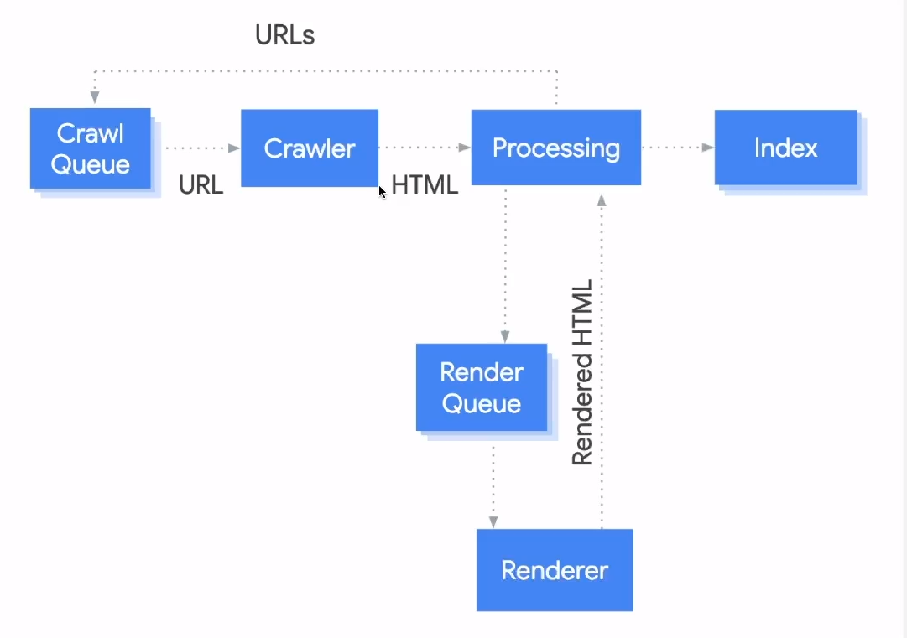

# SEO - Search Engine Optimization
- Otimização para Motores de Busca
- Páginas HTML aparecendo nas pesquisas
- Melhora o tráfego no seu site, aumentando a visibilidade de marca e consequentemente as vendas

## Fatores fundamentais da otimização

### On-page
  - Técnico - Desenvolvedor
  - Conteúdo - Copywriter/Redator
## Off-page
  - Compartilhamento de links
  - Existir links do seu site sendo compartilhados por outros sites

## SERP - Search Engine Result Page
- Página de Resultados do Motor de Busca
- Os primeiros sites exibidos irão mudar de acordo com o SERP

## Core Web Vitals
Métricas que medem a experiência do usuários em sites, sites como boas pontuações são mais propensos a serem bem ranqueados nos resultados de busca

Se manter atualizado por esse site: [https://web.dev/articles/vitals](https://web.dev/articles/vitals)

Podemos medir os Core Web Vitals usando ferramentas como [PageSpeed Insights](https://pagespeed.web.dev) 

## 3 Estágios do Google
Como trabalham os robôs e algoritmos do Google, aqui também temos a [Documentação Oficial da Google](https://developers.google.com/search/docs?hl=en)

### 01 - Crawling

O estágio de rastreamento (crawling) é o primeiro passo do processo de indexação do Google. Durante essa etapa, os "bots" do Google, conhecidos como "Googlebot", percorrem a web em busca de novas páginas ou de alterações em páginas já conhecidas. Esses bots seguem links de uma página para outra, identificando novos conteúdos para indexar. O rastreamento é contínuo e dinâmico, já que a web está em constante evolução com novos sites, páginas e atualizações.

### 02 - Indexing
Após o rastreamento, as páginas encontradas pelo Googlebot são processadas e adicionadas ao índice do Google. O processo de indexação envolve analisar o conteúdo das páginas, entender sua relevância, identificar palavras-chave e organizar essas informações de forma a facilitar a recuperação posterior pelos usuários através das pesquisas. Durante a indexação, o Google também leva em consideração fatores como a qualidade do conteúdo, a autoridade do site e a experiência do usuário para determinar a posição nos resultados de busca.

### 03 - Serving
O estágio de servir (serving) refere-se à entrega dos resultados de busca aos usuários quando realizam uma consulta no Google. Nessa fase, o algoritmo de busca do Google processa a consulta do usuário, busca no índice as páginas relevantes e as classifica de acordo com vários fatores, como relevância, autoridade do site, localização geográfica, entre outros. Os resultados são então apresentados aos usuários em forma de SERP (página de resultados de busca), onde podem encontrar os links para as páginas mais relevantes de acordo com sua pesquisa.

## Rendering
Processo de interpretação e renderização do JavaScript para o HTML

A interpretação ocorre como se fosse pelo navegador.
Esse processo pode levar dias ou semanas em alguns casos.
Alguns frameworks passam por essa etapa de renderização, já que são construídos principalmente em JavaScript: Vue, Angular, React...

No entanto, existem alternativas que foram desenvolvidas considerando os motores de busca e a otimização para SEO: Next.js, Astro.build, Wordpress

## URL - Uniform Resourse Locator

- O motor de busca do Google leva em concideração o [RCF 3986](https://www.rfc-editor.org/rfc/rfc3986), que é um padrão de como funciona as URLs/URIs
- Não podem conter caracteres especiais e nem espaços
  - Serão convertidas em um formato ASCII válido

### Melhores práticas para URLs
- Simples e descritiva  
  [https://blog.rocketseat.com.br/como-iniciar-em-programacao]()
- Palavras descritivas na URL, se aplicavél  
  [https://blog.rocketseat.com.br/br/iniciantes/aprender-programacao]()
- UTF-8 encoding  
  [https://blog.rocketseat.com.br/br/programa%25E7%25E3o]()

### Piores práticas para URLs
- Ruim para a leitura de um ser humano  
  [https://blog.rocketseat.com.br/index.php?sid=190fd9df98&tid=31]()
- NO-ASCII caracteres  
  [https://blog.rocketseat.com.br/programação]()
- Underscore  
  [https://blog.rocketseat.com.br/como_iniciar_em_programacao]()
- Palavras juntas = Ruim para a leitura de um ser humano 
  [https://blog.rocketseat.com.br/comoiniciaremprogramacao]()

### Dicas
- Crie uma estrutura de URL simples  
  Considere organizar seu conteúdo de forma que as URLs sejam construídas de maneira lógica e mais inteligível para os humanos
- Usar um arquivo `robots.txt`para bloquear o acesso do Googlebot a URLs problemáticas  
  Considere bloquear URLs dinâmicas, como URLs que geram resultados de pesquisa, ou URLs que pode criar espaços infinitos, como calendários.  
  Usar expressões regulares pode permitir que você bloqueie facilmente um grande número de URLs
- Evite uso de IDs de sessão em URLs
- Mantenha a URL homogênea, use letras maiúsculas ou minúsculas  
- Encurte as URLs, removendo parâmetros desnecessários
- Se o seu site tem um calendário infinito, adicione um atributo `no-follow` aos links
- Verifique links quebrados

### Certificado SSL
- Dados encriptados
- `https` é mais relevante que o `http`
- Para o Googlebot a URL com e sem `www` são diferentes
- Adicione todas a variações no Search Console
  - https + sem o www 
  - https + com o www 
  - http + sem o www 
  - http + com o www 
- Trabalhe com redirecionamento canônico  
  Defina uma principal e redirecione todas a as outras para essa página, para evitar conteúdo duplicado

## Links
São utilizados para encontrar uma nova página

- Os links vão ser ratreáveis apenas pela tag `<a>`com o atrubuto `href`
- Qualidade do texto no link
  - Tetxo claro do que a página referência é
  - Pode usar o atributo `title` para isso
  - Se for imagem, o Google irá utilizar o atributo `alt` da imagem com texto
  - Simples conciso, natural

### Links internos
- Referencia ao próprio conteúdo
- Melhor entendimento do Google ao site como um todo
- Ajuda a encontrar outras páginas dentro do seu próprio site
- Recomendado ter ao menos 1 link referênciando outra página  
  Ajuda na experiÊncia do usuário

### Links externos
- Ajuda a estabelecer confiança   
  Geralmente as pessoas irão citar bons cites para seus leitores  
  O robô entende que o conteúdo é relevante, pois está citando a fonte

- É ótimo para o robô encontrar bons sites  
  Aumenta a relevância do cite citado perante o Googlebot

- Qualificando os links externos com `rel` (relationship)
  - `no-follow`: se você não confiar na fonte
  - `ugc`: conteúdos genéricos de usuários
  - `sponsered`: links pagos
  - Esses atributos podem ser utilizados juntos, apenas separados por vírgulas
